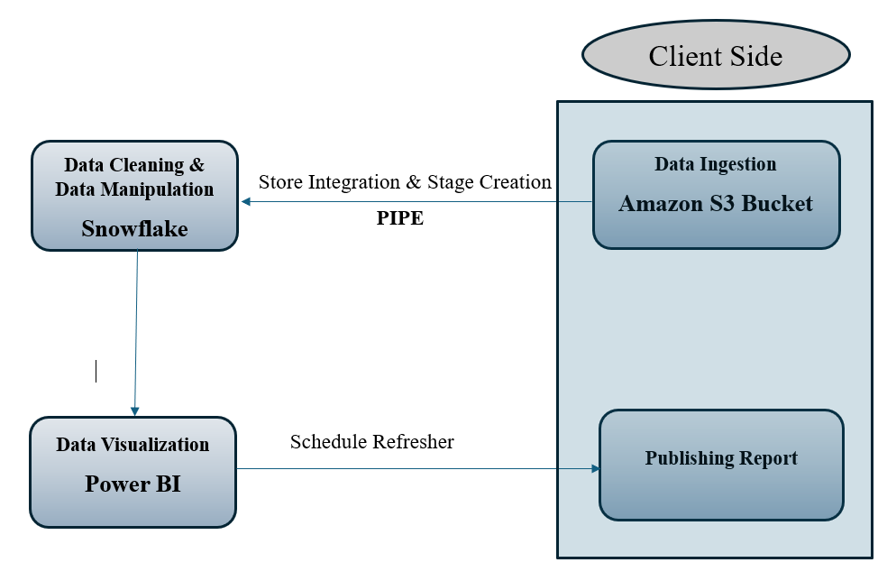
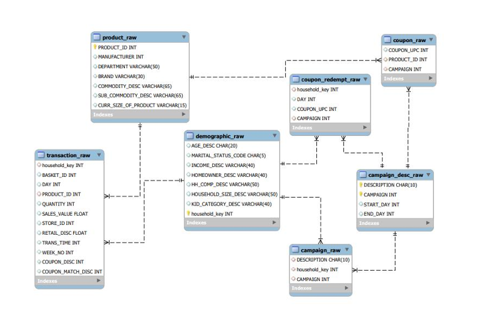
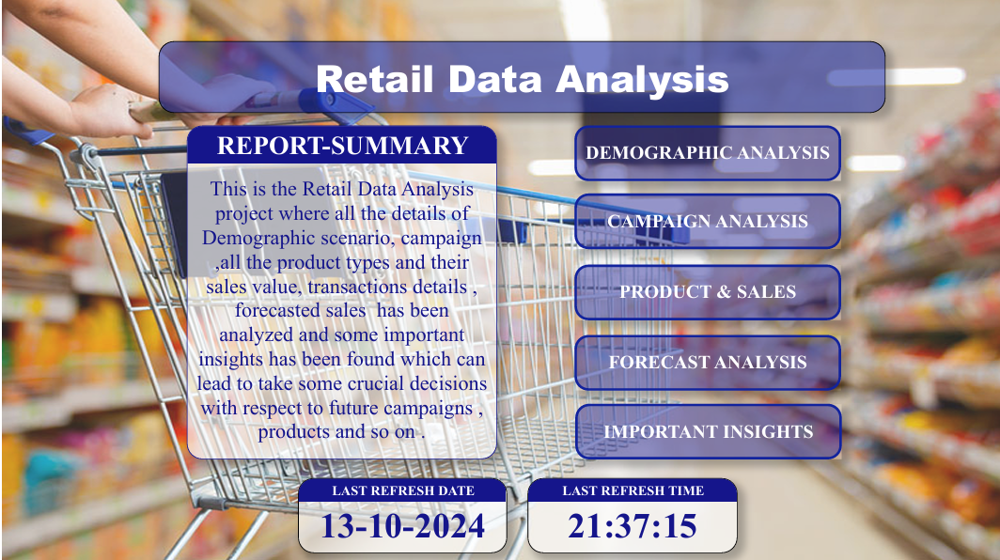
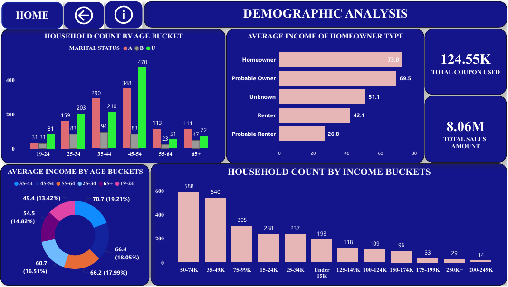
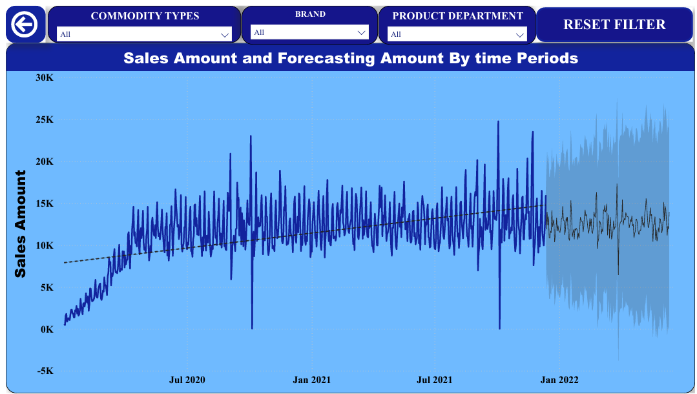

## **Retail Data Analysis:**

### **Problem Statement :**

I have been given datasets, contains household-level transactions over two years from a group 
of 2,500 households who are frequent shoppers at a retailer. It contains all of 
each household’s purchases, not just those from a limited number of categories. 
For households, demographic information as well as direct marketing contact 
history are included. My task was to build various KPIs like customer's Demographic KPIs, Campaign KPIs, Coupon KPIs, Product KPIs, Transaction KPIs. Also I had to forecast the future trends. (I have already attached detailed problem statement in this repository).

### **My Approach :**

#### **`1.Data Ingestion` :**
Data were stored in Amazon S3 buckets and I had to establish a connection between amazon S3 bucket and snowflake for continuous data ingestion.

#### **`2.Data Cleaning` & `Data Manipulation` :**

For Data cleaning and data manipulation, I used snowflake tool where I transformed some columns like creating date columns using no of days, finding the time periods for each campaign and so on.

#### **3. `Data Visualization`:**

I used Power BI tool for data visualization where I have used various charts like cards for numbers, line chart for trends, bar chart for finding top n values and many more.

### **Diagram of the workflow :**

### ** `ER diagram` :**

## **USE MY REPORT [HERE](https://app.powerbi.com/view?r=eyJrIjoiN2I1N2ZjMmItNGE5OC00ODkyLTgwNWUtMGYyNDAyZGIwYjRiIiwidCI6ImY4N2I2ZjgyLTIxNTUtNDc5Zi1iYThiLTRkNTdkN2Q2OWUwZiJ9)**

## **Some Sample snapshots of my work :**

